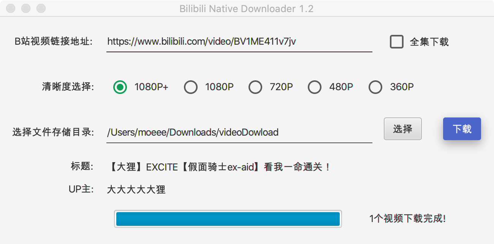

# 哔哩哔哩视频下载器

## 作者(MoEee)

## 邮箱(zanaruto@hotmail.com)

## 特点
* Mac和Windows可以安装到本地
* 有界面
* 无需安装环境(安装包自带，傻瓜式安装)
* 配合B站升级的BV号
* 最高1080p+画质
* 优先mp4格式(如果原视频有的话)
* 批量下载
* 多线程下载
* Java

## 界面



## 编译
### 环境
JDK8+
Maven

### 命令
```shell script
mvn clean jfx:native
```
### 相关文件
#### 应用图标所在文件夹
```shell script
${PROJECT_PATH}/src/main/deploy/package
```

#### 编译后的安装包所在文件夹
```shell script
${PROJECT_PATH}/target/jfx/native
```